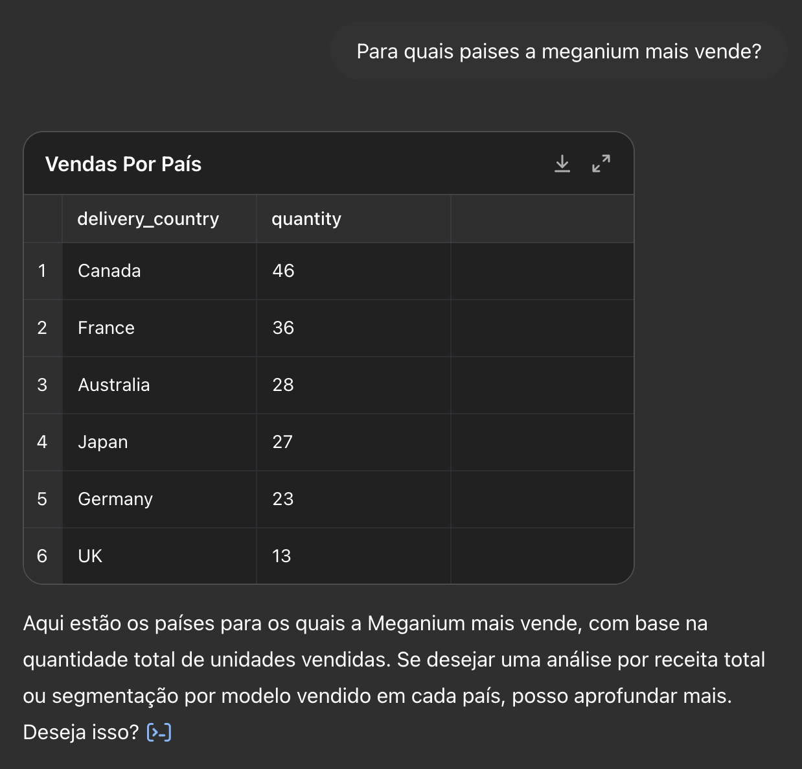
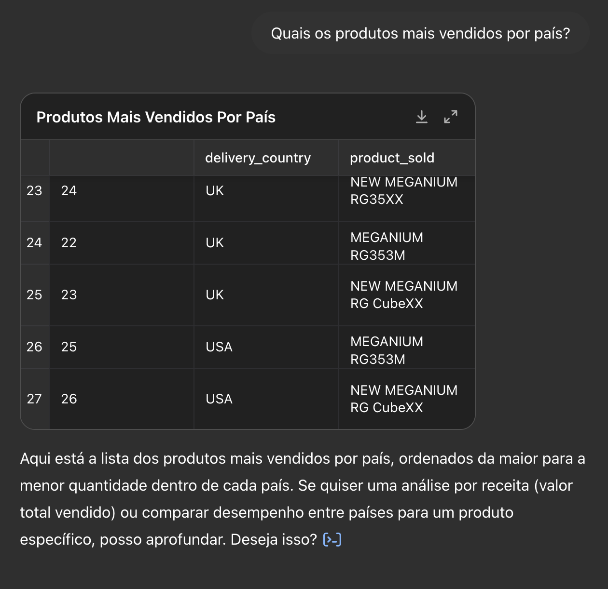

### Resultados

Prompt: Que insights você pode me fornecer em relação as vendas da Meganium?

Resposta: Com base nos dados analisados, aqui estão alguns insights relevantes sobre as vendas da Meganium:

1. Produtos Mais Vendidos
O modelo NEW MEGANIUM RG 40XXV é o mais vendido em termos de unidades (41 unidades).

Entretanto, outros três modelos vendem quantidades muito próximas entre si: RG CubeXX, RG28XX e RG35XX (36 unidades cada).

2. Produtos com Maior Receita Líquida
O RG 40XXV também lidera em receita líquida: €3.426,93.

O modelo RG353M, apesar de vender menos unidades (29), gera uma receita expressiva: €2.637,85, sugerindo um ticket médio mais alto ou menor aplicação de descontos.

3. Canais de Venda
Shopee é o principal canal de vendas, com 64 unidades vendidas.

AliExpress (58 unidades) e Etsy (56 unidades) também têm desempenho relevante, mas ficam ligeiramente atrás.

Isso pode indicar que Shopee possui maior penetração ou atratividade para o público da Meganium.

4. Tendência de Vendas ao Longo do Tempo
As vendas aumentaram consistentemente de maio a agosto de 2024, atingindo o pico em agosto (47 unidades).

Houve uma leve queda em setembro (37) e estabilidade em outubro (38).

Isso sugere uma sazonalidade positiva no terceiro trimestre, possivelmente relacionada a lançamentos ou promoções.

Recomendações:
Foco no RG 40XXV: Reforçar produção e promoção desse modelo, dado seu sucesso tanto em unidades quanto em receita.

Atenção à RG353M: Apesar de menor volume, sua rentabilidade é alta – pode valer impulsionar vendas com marketing direcionado.

Aproveitar Shopee: Investir em campanhas nesse canal pode trazer retornos rápidos, dado o alto volume de vendas já registrado.

Preparar-se para o Q3: Considerar reforço de estoque e marketing entre julho e setembro, período de maior demanda.

Se quiser, posso detalhar ainda mais por região, por canal ou por faixa etária dos compradores. Deseja isso? 